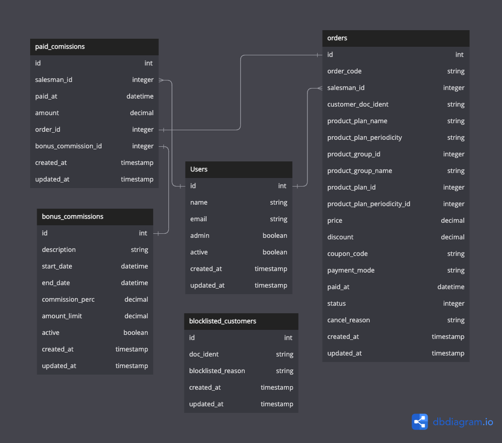

# README

## Database diagram:


<br />

## Instalação:
  - bin/setup
  - yarn install
  - yarn build


## Pré-populando o DB (Seeds):
  - Após instalação rodar `rails db:seed` para pré-popular o db.

## Testes:
  - RSpec
    ```bash
    bundler exec rspec
    ```
    
## Executando a aplicação pela primeira vez (Modo desenvolvedor):
  - Execute o comando `bin/dev`
  - Login: admin@locaweb.com.br | Senha: 12345678

<br>

## Configurando urls para integração com APIs externas:
  - As configurações de url para APIs externas de clientes e produtos estão localizadas no arquivo ./config/apis.yml
  
  Exemplo:
  ```yaml
    products_api_url: 'http://localhost:3001/api/v1'
    customer_api_url: 'http://localhost:3002/api/v1/clients'
    payments_api_url: 'http://localhost:3003/api/v1'
  ```
  


<br>

## API - Endpoints:

<details>
  <summary>
    <b>Lista de pedidos pendentes</b>
  </summary>
  <br>
  <b>Método HTTP / URL</b>

  `GET` /api/v1/customers/{doc_client}/orders

  **Parâmetros**

- Content-Type: `application/json`
- Passar o documento do cliente como parâmetro na URL

#### **Respostas**

*- Sucesso:*

- Código `200`

``` sh
[
    {
        "price": "50.0",
        "discount": "0.0",
        "payment_mode": null,
        "status": "pending",
        "created_at": "2023-03-05T15:58:10.312-03:00",
        "updated_at": "2023-03-05T15:58:10.312-03:00",
        "order_code": "GPQJU3FPN5",
        "product_plan_name": "Plano Prata",
        "product_plan_periodicity": "Mensal",
        "customer_doc_ident": "32100022201",
        "paid_at": null,
        "product_group_id": 1,
        "product_group_name": "Hospedagem de Sites",
        "product_plan_id": 2,
        "product_plan_periodicity_id": 2,
        "coupon_code": null,
        "salesman": {
            "email": "vendedor@locaweb.com.br",
            "name": "vendedor"
        }
    }
]
```

*- Caso não sejam encontrados pedidos*

- Código: `404`

```sh
{
  "response": "Nenhum registro encontrado"
}
```
*- Caso exista um erro interno da api*

- Código: `500`

```sh
{
  "error": "Ocorreu um erro interno"
}
```

</details>

<details>
  <summary>
    <b>Adiciona desconto ao pedido</b>
  </summary>
  <br>
  <b>Método HTTP / URL</b>

  `POST` /api/v1/orders/{order_code}/discount

  **Parâmetros**

- Content-Type: `application/json`
- Passar o código do pedido como parâmetro na URL
- Passar o desconto como parâmetro no `BODY` da requisição

``` sh
{
	"discount": "10.99" 
}
```

#### **Respostas**

*- Sucesso:*

- Código `200`

``` sh
{
    "payment_mode": "credit_card",
    "discount": "10.0",
    "paid_at": "2023-03-05T17:17:29.840-03:00",
    "status": "pending",
    "price": "70.0",
    "created_at": "2023-03-05T15:58:10.347-03:00",
    "updated_at": "2023-03-05T17:17:29.873-03:00",
    "order_code": "3UHEOUEGN1",
    "product_plan_name": "Plano Ouro",
    "product_plan_periodicity": "Anual",
    "customer_doc_ident": "32100022201",
    "product_group_id": 1,
    "product_group_name": "Hospedagem de Sites",
    "product_plan_id": 3,
    "product_plan_periodicity_id": 3,
    "coupon_code": null,
    "salesman": {
        "email": "vendedor2@locaweb.com.br",
        "name": "vendedor2"
    }
}
```

*- Caso não sejam encontrados pedidos*

- Código: `404`

```sh
{
  "response": "Nenhum registro encontrado"
}
```

*- Caso não seja enviado o modo de pagamento*

- Código: `400`

``` sh
{
  "error": "Desconto não informado"
}
```

*- Caso exista um erro interno da api*

- Código: `500`

```sh
{
  "error": "Ocorreu um erro interno"
}
```
</details>

<details>
  <summary>
    <b>Altera o status do pedido para pago</b>
  </summary>
  <br>
  <b>Método HTTP / URL</b>

  `POST` /api/v1/orders/{order_code}/pay

  **Parâmetros**

- Content-Type: `application/json`
- Passar o código do pedido como parâmetro na URL
- Passar o modo de pagamento como parâmetro no `BODY` da requisição

``` sh
{
	"payment_mode": "credit_card",
}
```

#### **Respostas**

*- Sucesso:*

- Código `200`

``` sh
{
    "payment_mode": "credit_card",
    "discount": "0.0",
    "paid_at": "2023-03-05T17:17:29.840-03:00",
    "status": "paid",
    "price": "70.0",
    "created_at": "2023-03-05T15:58:10.347-03:00",
    "updated_at": "2023-03-05T17:17:29.873-03:00",
    "order_code": "3UHEOUEGN1",
    "product_plan_name": "Plano Ouro",
    "product_plan_periodicity": "Anual",
    "customer_doc_ident": "32100022201",
    "product_group_id": 1,
    "product_group_name": "Hospedagem de Sites",
    "product_plan_id": 3,
    "product_plan_periodicity_id": 3,
    "coupon_code": null,
    "salesman": {
        "email": "vendedor2@locaweb.com.br",
        "name": "vendedor2"
    }
}
```

*- Caso não sejam encontrados pedidos*

- Código: `404`

```sh
{
  "response": "Nenhum registro encontrado"
}
```

*- Caso não seja enviado o modo de pagamento*

- Código: `400`

``` sh
{
  "error": "Modo de pagamento não informado"
}
```

*- Caso exista um erro interno da api*

- Código: `500`

```sh
{
  "error": "Ocorreu um erro interno"
}
```
</details>


<details>
  <summary>
    <b>Altera o status do pedido para cancelado</b>
  </summary>
  <br>
  <b>Método HTTP / URL</b>

  `POST` /api/v1/orders/{order_code}/cancel

  **Parâmetros**

- Content-Type: `application/json`
- Passar o código do pedido como parâmetro na URL
- Passar o motivo do cancelamento como parâmetro no `BODY` da requisição

``` sh
{
	"cancel_reason": "O cliente desistiu"
}
```

#### **Respostas**

*- Sucesso:*

- Código `200`

``` sh
{
    "status": "cancelled",
    "cancel_reason": "Cliente desistiu",
    "price": "70.0",
    "discount": "0.0",
    "payment_mode": "credit_card",
    "created_at": "2023-03-05T15:58:10.347-03:00",
    "updated_at": "2023-03-05T17:19:36.533-03:00",
    "order_code": "3UHEOUEGN1",
    "product_plan_name": "Plano Ouro",
    "product_plan_periodicity": "Anual",
    "customer_doc_ident": "32100022201",
    "paid_at": "2023-03-05T17:17:29.840-03:00",
    "product_group_id": 1,
    "product_group_name": "Hospedagem de Sites",
    "product_plan_id": 3,
    "product_plan_periodicity_id": 3,
    "coupon_code": null,
    "salesman": {
        "email": "vendedor2@locaweb.com.br",
        "name": "vendedor2"
    }
}
```

*- Caso não sejam encontrados pedidos*

- Código: `404`

```sh
{
  "response": "Nenhum registro encontrado"
}
```

*- Caso não seja enviado o motivo de cancelamento*

- Código: `404`

``` sh
{
	"error": "Motivo do cancelamento não informado"
}
```

*- Caso exista um erro interno da api*

- Código: `500`

```sh
{
  "error": "Ocorreu um erro interno"
}
```
</details>

<details>
  <summary>
    <b>Altera status do pedido para aguardando confirmação pagamento</b>
  </summary>
  <br>
  <b>Método HTTP / URL</b>

  `POST` /api/v1/orders/{order_code}/awaiting_payment

  **Parâmetros**

- Content-Type: `application/json`
- Passar o documento do cliente como parâmetro na URL

#### **Respostas**

*- Sucesso:*

- Código `200`

``` sh
[
    {
        "price": "50.0",
        "discount": "0.0",
        "payment_mode": null,
        "status": "awaiting_payment",
        "created_at": "2023-03-05T15:58:10.312-03:00",
        "updated_at": "2023-03-05T15:58:10.312-03:00",
        "order_code": "GPQJU3FPN5",
        "product_plan_name": "Plano Prata",
        "product_plan_periodicity": "Mensal",
        "customer_doc_ident": "32100022201",
        "paid_at": null,
        "product_group_id": 1,
        "product_group_name": "Hospedagem de Sites",
        "product_plan_id": 2,
        "product_plan_periodicity_id": 2,
        "coupon_code": null,
        "salesman": {
            "email": "vendedor@locaweb.com.br",
            "name": "vendedor"
        }
    }
]
```

*- Caso não sejam encontrados pedidos*

- Código: `404`

```sh
{
  "response": "Nenhum registro encontrado"
}
```
*- Caso exista um erro interno da api*

- Código: `500`

```sh
{
  "error": "Ocorreu um erro interno"
}
```

</details>

<details>
  <summary>
    <b>Renovação de Pedido</b>
  </summary>
  <br>
  <b>Método HTTP / URL</b>

  `POST` /api/v1/orders/{order_code}/renew

  **Parâmetros**

- Content-Type: `application/json`
- Passar o documento do cliente como parâmetro na URL

#### **Respostas**

*- Sucesso:*

- Código `200`

``` sh
[
    {
        "price": "50.0",
        "discount": "0.0",
        "payment_mode": null,
        "status": "pending",
        "created_at": "2023-03-05T15:58:10.312-03:00",
        "updated_at": "2023-03-05T15:58:10.312-03:00",
        "order_code": "GPQJU3FPN5",
        "product_plan_name": "Plano Prata",
        "product_plan_periodicity": "Mensal",
        "customer_doc_ident": "32100022201",
        "paid_at": null,
        "product_group_id": 1,
        "product_group_name": "Hospedagem de Sites",
        "product_plan_id": 2,
        "product_plan_periodicity_id": 2,
        "coupon_code": null,
        "salesman": {
            "email": "vendedor@locaweb.com.br",
            "name": "vendedor"
        }
    }
]
```

*- Caso não sejam encontrados pedidos*

- Código: `404`

```sh
{
  "response": "Nenhum registro encontrado"
}
```
*- Caso plano esteja inativo*

- Código: `400`

```sh
{
  "error": "Plano não está mais ativo."
}

*- Caso exista um erro interno da api*

- Código: `500`

```sh
{
  "error": "Ocorreu um erro interno"
}
```

</details>